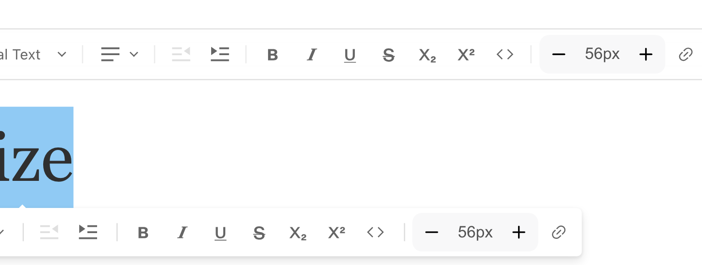

# lexical-text-size

[](https://badge.fury.io/js/@payloadcms-toolbox%2Flexical-text-size)
[](https://opensource.org/licenses/MIT)
[](https://www.npmjs.com/package/@payloadcms-toolbox/lexical-text-size)
[](https://www.typescriptlang.org/)

A powerful, type-safe text size management feature for [Lexical](https://lexical.dev/) editors in [Payload CMS](https://payloadcms.com/). Provides an intuitive toolbar control for adjusting text sizes with full HTML/CSS conversion support.



## Table of Contents

- [The Problem](#the-problem)
- [This Solution](#this-solution)
- [Features](#features)
- [Requirements](#requirements)
- [Installation](#installation)
- [Usage](#usage)
  - [Global Configuration](#global-configuration)
  - [Per-Field Configuration](#per-field-configuration)
- [Configuration Options](#configuration-options)
- [API Reference](#api-reference)
- [Customization](#customization)
- [TypeScript](#typescript)
- [Troubleshooting](#troubleshooting)
- [FAQ](#faq)
- [License](#license)

## The Problem

This plugin was created because the built-in TextStateFeature in Payload CMS provides only a generic solution for text styling. There were no ready-made, simple solutions available with familiar UX/UI for text size management specifically. This gap led to the creation of this plugin to provide an intuitive, easy-to-use text sizing feature for content editors.

## This Solution

`lexical-text-size` provides a **production-ready, plug-and-play solution** that:

✅ Integrates seamlessly with Payload CMS's Lexical editor  
✅ Adds a toolbar button for text size selection  
✅ Supports custom size values (predefined or custom)  
✅ Handles HTML/Markdown conversion automatically  
✅ Fully typed with TypeScript  
✅ Works with Lexical's undo/redo system  
✅ Follows Payload CMS [Custom Features](https://payloadcms.com/docs/rich-text/custom-features) best practices

## Features

- 🎨 **Visual Toolbar Control**: Easy-to-use dropdown in the Lexical toolbar
- 🔧 **Fully Customizable**: Define your own size values and labels
- 📝 **HTML/Markdown Support**: Automatic conversion to and from HTML/Markdown
- 🌐 **i18n Ready**: Built-in internationalization support
- ⚡ **Performance Optimized**: Lazy-loaded components for minimal bundle size
- 🔒 **Type-Safe**: Full TypeScript definitions included
- ♿ **Accessible**: ARIA-compliant UI components
- 🎯 **Server & Client Features**: Follows Payload CMS architecture patterns

## Requirements

- **@payloadcms/richtext-lexical**: `^3.0.0`
- **React**: `>= 19.0.0`
- **Node.js**: `>= 18.0.0` (recommended)

## Installation

```bash
npm install @payloadcms-toolbox/lexical-text-size
```

```bash
yarn add @payloadcms-toolbox/lexical-text-size
```

```bash
pnpm add @payloadcms-toolbox/lexical-text-size
```

### Peer Dependencies

This package has the following peer dependencies (usually already installed with Payload CMS):

```json
{
  "@payloadcms/richtext-lexical": "^3",
  "react": ">=19"
}
```

## Usage

### Global Configuration

Configure the text size feature globally for **all** rich text fields in your `payload.config.ts`:

```ts
import { lexicalEditor } from '@payloadcms/richtext-lexical'
import { TextSizeFeature } from '@payloadcms-toolbox/lexical-text-size'
import { buildConfig } from 'payload'

export default buildConfig({
  // ... other config
  editor: lexicalEditor({
    features: ({ defaultFeatures }) => [
      ...defaultFeatures,
      TextSizeFeature({
        sizes: ['12px', '14px', '16px', '18px', '24px', '32px'],
        defaultSize: '16px'
      })
    ]
  }),
  // ... rest of config
})
```

### Per-Field Configuration

Add the text size feature to **specific** rich text fields:

```ts
import { lexicalEditor } from '@payloadcms/richtext-lexical'
import { TextSizeFeature } from '@payloadcms-toolbox/lexical-text-size'

export const Pages = {
  slug: 'pages',
  fields: [
    {
      name: 'content',
      type: 'richText',
      editor: lexicalEditor({
        features: ({ defaultFeatures }) => [
          ...defaultFeatures,
          TextSizeFeature({
            sizes: ['12px', '14px', '16px', '18px', '24px', '32px'],
            defaultSize: '16px'
          })
        ]
      })
    }
  ]
}
```

## Configuration Options

The `TextSizeFeature` function accepts a configuration object with the following options:

| Option | Type | Default | Description |
|--------|------|---------|-------------|
| `sizes` | `string[]` | `['6px', '8px', '10px', '12px', '14px', '16px', '18px', '20px', '24px', '28px', '32px', '36px', '40px', '48px', '56px', '64px', '72px']` | Array of available text sizes. Must be valid CSS font-size values (e.g., `'16px'`, `'1rem'`, `'1.5em'`). Array is ordered from smallest to largest. |
| `defaultSize` | `string` | First element of `sizes` array | Default size applied to text. Must be one of the values in the `sizes` array. If not provided or invalid, the first element of `sizes` will be used. |

## API Reference

### `TextSizeFeature(options?)`

Creates a text size feature for the Lexical editor.

**Parameters:**
- `options` (optional): Configuration object

**Returns:** Lexical feature that can be passed to the `features` array

**Example:**
```ts
ration (no parameters needed)


// Custom sizes
TextSizeFeature({
  sizes: ['12px', '16px', '20px', '24px'],
  defaultSize: '16px'
})

// Using rem units
TextSizeFeature({
  sizes: ['0.75rem', '1rem', '1.25rem', '1.5rem'],
  defaultSize: '1rem'
})
```

## Customization

Define your own custom sizes with any valid CSS font-size values:

```ts
// Using px units
TextSizeFeature({
  sizes: ['10px', '12px', '14px', '16px', '18px', '24px', '32px', '48px'],
  defaultSize: '16px'
})

// Using rem units (recommended for accessibility)
TextSizeFeature({
  sizes: ['0.625rem', '0.75rem', '0.875rem', '1rem', '1.125rem', '1.5rem', '2rem', '3rem'],
  defaultSize: '1rem'
})

// Using em units
TextSizeFeature({
  sizes: ['0.75em', '1em', '1.25em', '1.5em', '2em'],
  defaultSize: '1em'
})
```

## TypeScript

This package is written in TypeScript and provides full type definitions.

### Type-Safe Configuration

```ts
import { TextSizeFeature } from '@payloadcms-toolbox/lexical-text-size'

TextSizeFeature({
  sizes: ['12px', '16px', '20px', '24px'],
  defaultSize: '16px'
})
```

## Troubleshooting

### Feature not appearing in toolbar

**Problem:** The text size button doesn't show up in the editor toolbar.

**Solution:**
1. Ensure you're using Payload CMS >= 3.0.0
2. Check that the feature is added to the `features` array
3. Verify that `@payloadcms/richtext-lexical` is installed
4. Clear your build cache: `rm -rf .next` or `rm -rf dist`

### Sizes not applying correctly

**Problem:** Selecting a size doesn't change the text appearance.

**Solution:**
1. Check your CSS for conflicting `font-size` rules
2. Use browser DevTools to inspect the applied styles
3. Ensure your `customSizeMap` values are valid CSS
4. Check console for any JavaScript errors

### TypeScript errors

**Problem:** Type errors when using the feature.

**Solution:**
```bash
# Ensure types are properly installed
npm install --save-dev @types/react

# Clear TypeScript cache
rm -rf node_modules/.cache
```

### Build errors with Next.js

**Problem:** "Module not found" or SSR errors.

**Solution:**
```js
// next.config.js
module.exports = {
  transpilePackages: ['@payloadcms-toolbox/lexical-text-size']
}
```

## FAQ

### Can I use this with Lexical outside of Payload CMS?

Currently, this package is specifically designed for Payload CMS's Lexical integration. For standalone Lexical, you would need to adapt the feature implementation.

### Can I use rem, px, em, or other CSS units?

Yes! The `sizes` array accepts any valid CSS font-size value:

```ts
TextSizeFeature({
  sizes: ['14px', '1.2em', '2rem', '18pt'],
  defaultSize: '14px'
})
```

We recommend using `rem` units for better accessibility and consistent scaling across your application.

### Does this work with dark mode?

Yes, the feature respects Payload CMS's theme settings automatically.


## License

MIT © 2024 Evgenii Troinov

See [LICENSE](./LICENSE) file for details.

---

Made with ❤️ for the [Payload CMS](https://payloadcms.com/) community
